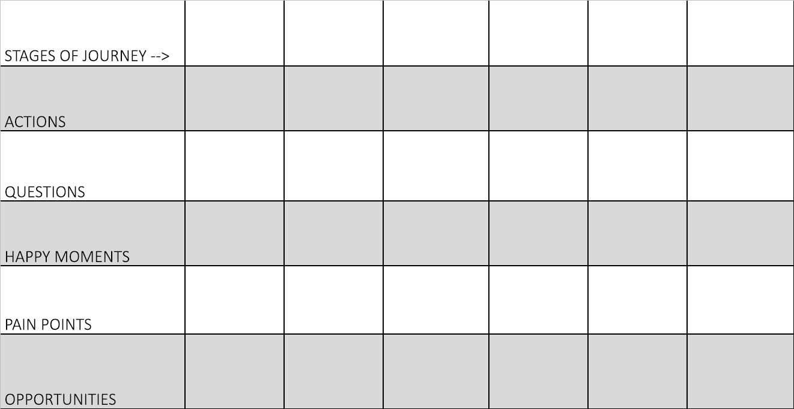

# Journey Map

**Purpose:** To establish a detailed understanding of what a user will face when navigating systems within the context of the challenge a team is addressing, or will face within the context of their prototype. 

**Materials:** Flipchart paper, post-its and markers for each team. A piece of flipchart paper at the front of the room with Journey Map Template.

[Example of Journey Map template in action](https://drive.google.com/file/d/1jzgB5A79lp4wld2nDOEhCMDvrgHzaK43/view?usp=sharing)

* **Actions:** the thing the user needs to do to move to the next step
* **Questions:** things the user needs answering before they’ll be willing to move to the next step
* **Happy moments:** positive, enjoyable things that improve the experience
* **Pain points:** frustrations and annoyances that spoil the experience
* **Opportunities:** design enhancements that you could implement in a new product, that address any of the problems identified.

**Time:** 60 - 90 minutes

**Step one:** Remind participants of their persona, and have them place it somewhere visible if it isn’t already displayed. If participants haven’t made an unabridged persona template, introduce a simple persona template and give them time to fill out the following attributes: Name, Role, Quote, Important Demographics \(assess what might be relevant - age, gender, sexuality, religion, socio-economic status, education, etc.\), Needs, Wants, Pain, Joy, Ambitions. 

**Step two:** Explain that there are two types of user journey map, retrospective and prospective. In most cases, we facilitate a prospective journey map. In both cases, before beginning to map, have participants establish the journey they would like to send their users on and the initial mental state of the user. Most likely, participants will want to test their prototype \(or part of their prototype\) if it’s a prospective user journey, or a part of the challenge their prototypes seeks to address if it’s a retrospective user journey. To define the mental state of the user in both these scenarios, have participants use the context and scenario of the persona to define an initial mental state. 

**Step three:**  Instruct participants to take their created user through their journey, noting the different stages over time. Then, begin down the vertical axis, filling in the actions, questions, happy moments, pain points and opportunities that their user might feel or see over time. During this process, have them take time to describe why each step in time might be a pain point or a happy moment for their user \(include motivations and/or barriers\). 

Identify stages and steps. Let the workshop participants start with the rough stages of a journey map, such as “inspiration, planning, booking, experience, sharing” for a holiday. Now fill up the stages with the persona’s story. Sometimes it helps if you start “in the middle” with the most crucial steps and then ask yourself what happens before and what happens after these. Use simple sticky notes for this so you can easily add or discard steps and stages.  
  
Typical stages include: **recognizing** that there is a need, **searching** for a solution, **engaging** with a solution, having need **addressed**.

**Step four:** Once participants have filled out the entire grid to the best of their ability, have them go over each section of the grid and do a gut check - do the answers/reactions feel accurate, are their explanations realistic? If not, make necessary changes. 

**Step five:** As it is likely that there will be multiple users of the prototype, if there is time, have teams send another persona through the journey. If there isn’t time for this step, make sure that participants understand that the journey map, as with any social lab methodology, is an iterative process, and they will need to revisit it multiple times to test with different user profiles as their prototype evolves. 

**Step six:** \(This step could be done later on in the week, when preparing for user interviews or presentations if it would be helpful. Otherwise, this step isn’t absolutely necessary\). Have participants create a storyboard of the demo user journey map in order to run it by potential users to gain feedback, or in order to present back to the rest of the group.

