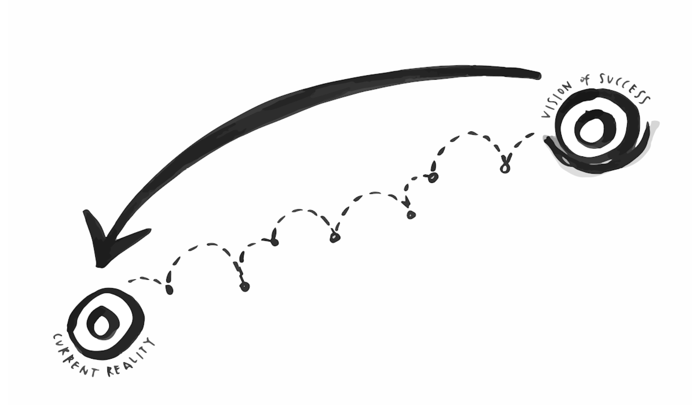

# Backcasting

We use backcasting once we have established a vision \(see page xx\) in order to re-situate ourselves in the current reality, and to ideate from it towards what we have imagined as our vision of success. Having determined our vision of success, there is a need to shape how we are going to get there. A backcasting approach helps to close the gap between the vision of success and the current reality by finding creative, flexible solutions. A more traditional approach in any kind of strategic planning is forecasting - when you use prior knowledge, the current reality and existing mental patterns to make decisions about what might be possible in the future. Backcasting instead starts with the vision, asks how we can get there and answers by providing flexible stepping stones for reaching success \(Robèrt and Broman, 2015\).

Backcasting is a deceivingly simple theory, but sets up the process of visioning really well, and invites conversations about being unreasonably optimistic when visioning and ideating - a necessary mindset in this work.

#### **More resources:** [**http://www.naturalstep.ca/backcasting**](http://www.naturalstep.ca/backcasting) ****

