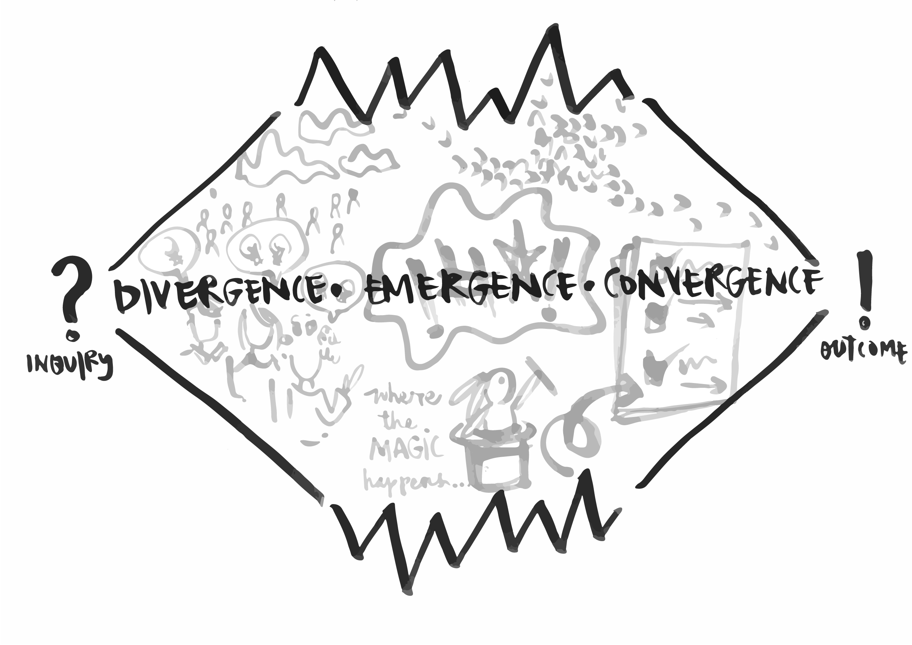

# Breath Pattern - Divergence - Emergence - Convergence

The breath pattern can be used as process architecture - as a way to design group processes - and it can be used as a way to explain the dynamics of group and change processes.

The breath pattern begins with a question or purpose and ends with some sort of outcome or clarification. In between, there are three phases: divergence, emergence, convergence.

### **Divergence**

The divergence phase is akin to the inhale of a breath. It is about opening up to new ideas and conversations. At this point, the group is following a specific goal and is undergoing a shared process/experience. Divergence is about getting as much information about the situation \(about the question or purpose\) as you possibly can. It’s about having lots of conversations, entertaining myriad perspectives, encouraging diverging opinions and multiple alternatives to the frame. It is a non-linear process, and it takes time. In the divergent phase, you may have to remind participants not to jump to solutions, but to slow down in order to be able to move quickly when the time comes. Often, the quality of the time participants spend in this process will indicate the quality of the outcome \(i.e. if participants rush through this phase and don’t allow for all voices and perspectives to be heard, then the outcome can be fairly predictable, not very innovative, and only work for a certain segment of the group. However, by spending quality time in this phase, hearing all perspectives, then the potential for the outcome to be innovative, transformative and work for everyone is greatly increased\).

### Emergence

 The emergence phase is akin to holding your breath, when all the oxygen is racing around your body, integrating with your blood and muscles to continually give you life. In the emergence phase, all the different ideas and perspectives that you’ve uncovered in the divergence phase are integrated. Different needs will also become integrated - including how you work together as a group and what you’re looking for as an outcome. This is the time for creativity, innovation and magic. The emergence phase requires us to stretch our thinking to hold and include other points of view, which can feel challenging. It is also fondly referred to as the ‘groan zone’, as participants tend to butt heads, feel challenged, spend more time outside of their comfort zones than they are used to. However, the ‘groan zone’ can also often be the ‘grown zone’, where participants experience the most growth. Emergence feels chaotic and messy and heightened and uncomfortable. But it is where the learning and magic happens. Emergence is the phenomenon of order arising out of chaos.

### Convergence 

The convergence phase is akin to the exhalation of a breath and the contraction of your lungs. Convergence happens as people have moved through the emergence phase and are ready to begin evaluating all the alternatives they have generated. This is a time to reconnect to your question or purpose, to summarise the key points, categorise alternatives and arrive at general conclusions. The convergence phase is focused on action, moving to decisions and outcomes and it is often quite quick in comparison to the divergence and emergence phases.

You can trace the breath pattern in every interaction, from a coffee with a friend to multi-stakeholder engagement processes. Every interaction will start with a question or intention and end with an outcome, and the quality of the experience will depend on how you move through the phases in between. While most groups will be able to identify \(and name\) the phases as they move through them, it’s not a given that all groups will move through all phases. Groups can also move through all phases, come to a convergence, and then diverge again, either with a different question or purpose, or the same one. Ideally, when designing a workshop or experience, you’re trying to end it in the convergence phase, to give participants a sense of accomplishment and closure. However, it’s important to note that groups will not move through the breath pattern just once. There are probably many small breath patterns that happen within a larger breath pattern \(daily breaths for example\), and even if groups move through to an outcome at the end of the session, they will necessarily need to diverge again as they continue to work on the project, prototype or relationship. The breath pattern - just like breathing - is a process we never finish.

#### More resources: [http://www.chriscorrigan.com/parkinglot/divergent-and-convergent-thinking/](http://www.chriscorrigan.com/parkinglot/divergent-and-convergent-thinking/
)

