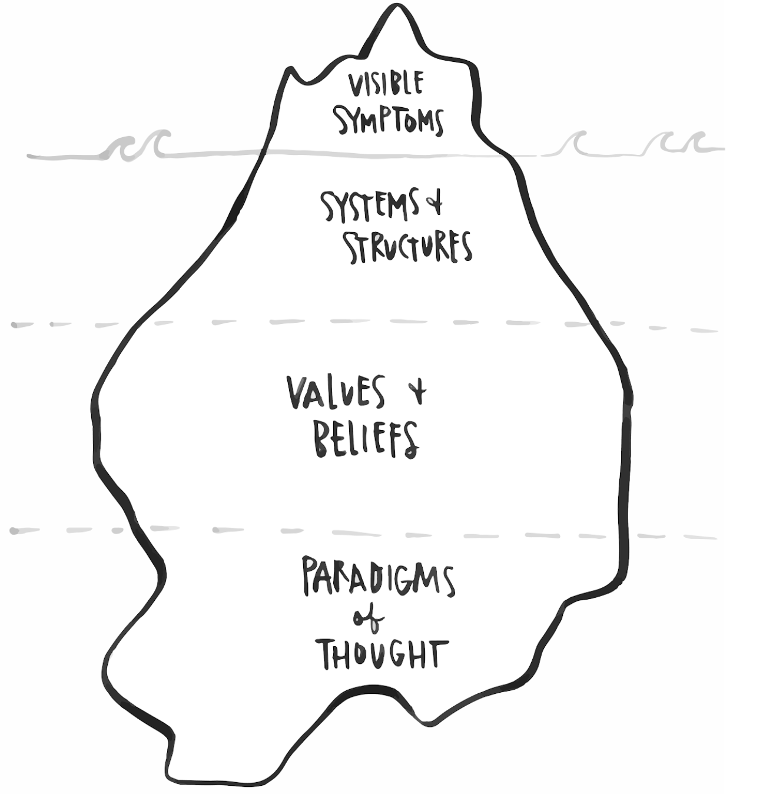
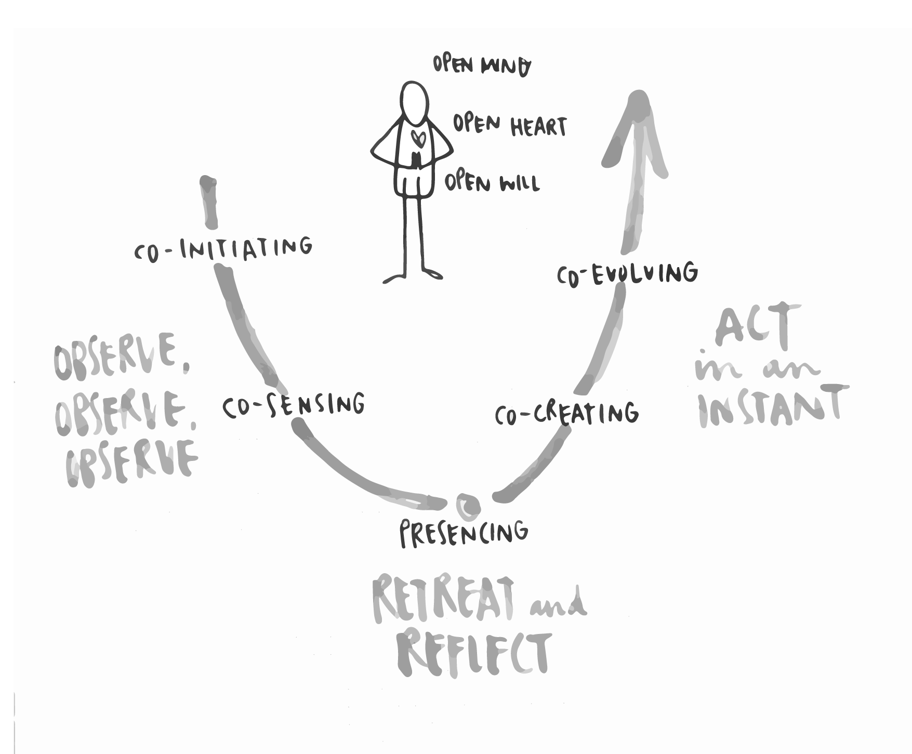

# Theory U

Theory U is a Theory of Change and a Framework for Change. It was developed by MIT Economist, Otto Scharmer, as a way of explaining the change phenomena he was seeing in the world.

As a **Theory of Change**, it focuses on the inner state of the changemaker as integral to the quality of the change they are trying to effect. Otto tells of being influenced by Bill O’Brien, the late CEO of Hanover Insurance, when he said that “the success of an intervention is dependent on the inner state of the intervenor.”

You can’t change a system without changing yourself. We are part of, and help to create and uphold, the systems we seek to change. Theory U explains the process of how we are embedded in systems using an Iceberg Model:

The symptoms above the water line show only about 10% of the story. When we see events or symptoms such as climate change, poverty, systemic discrimination, it can be hard to understand how we collectively keep on creating these results that no one would say that they want.

Below the water-line, however, we see that there are systems and structures that work to create the conditions for those symptoms to flourish. For example, if we are looking at the symptoms of climate change - global warming, ocean acidification, toxicity in our water and air, etc., then we can see that systems and structures such as the global fossil fuel industry \(which could be further segmented into automotive, shipping, air travel industries\) can be seen as a big part of the systems and structures that perpetuate and create the conditions for those symptoms of climate change to exist. Participants might point out that industry, as well as political and economic structures play a role in creating these conditions too.

How is it that these systems and structures exist? Why don’t we collectively make up our minds to change them? Well, because it is our collective belief and value systems that create and uphold those systems and structures. For example, we might believe that we need a car \(or two\) to exist in the world, and we might value individual agency and autonomy over collectivism, which might have instead resulted in more car-sharing models. The systems and structures we see, however abhorrent to us, only exist because collectively, a majority of us, or enough of those with power/voice, hold values and beliefs that form the epistemological justification.

Below our _values and beliefs_ are the _paradigms of thought_ - or mental models that create the basis for our collective values and beliefs. These paradigms of thought cut across culture and language - they denote the era we’re collectively living in. For examples, the paradigms of thought that we’re living under are neo-liberalism and late-stage capitalism, and these influences span the entire globe and hundreds of years. They can be seen as the huge tectonic plates on the ocean floor - they are massive and heavy, and we’re not moving them any time soon. Neoliberalism and late-stage capitalism can be characterised by privatisation, free-trade, market deregulation and private property.

The leverage point for change-work, then, is at the level of _values and beliefs_. The paradigms of thought are too massive to change, and focussing on change at the systems and structures level \(which is where typical change-efforts focus\) isn’t deep enough. Change that happens at the systems and structures level without changing the values and beliefs that have historically upheld those systems and structures will generally result in snap-back from the system. The level of values and beliefs is where we have absolute agency, and therefore it is our biggest leverage point for change. Being able to change our own values and beliefs - which ripples out into how we interact with the system - is the biggest leverage point we have to affect change. This is why Theory U focuses so much on the internal condition of the changemaker.

As a **Framework for Change**, Theory U has 3 movements and 5 stages.

The 3 movements are: Observe, observe, observe, which takes you down the left side of the U, Retreat and reflect, which happens at the bottom of the U, and Act in an Instant, which carries you up the right side of the U.

The five stages are:

**Co-initiating.** Creating shared space for common intention to manifest. What is my/our intention? Who are my peers? Listening to what the system is telling you, to what is coming up for you?

**Co-sensing.** Asking questions and making connections. Having conversations that you wouldn’t have normally. Putting yourself in a position of learning.

**Presencing.** A threshold moment, moment of transformation. Letting go and letting come. Who is myself and what is my work?

**Co-creating.** Crystallising the ‘aha’ moments that come out of presencing. Prototyping project ideas. And then, iterating/prototyping some more.

**Co-evolving.** Taking ideas to scale. Creating networks of change initiatives. The idea that rising tides float all boats.

So that’s HOW we work with Theory U. But what do we NEED in order to work with it? What personal characteristics do we need to cultivate to be able to successfully go through the process? We need an Open Mind, an Open Heart, and an Open Will.

Instead of an **Open Mind**, we often engage a **Voice of Judgement.**  
We need to suspend Judgement, and engage from curiosity.

Instead of an **Open Heart**, we often engage a **Voice of Cynicism**. We need to suspend Cynicism, and engage compassion, kindness and empathy.

Instead of an **Open Will**, we often engage a **Voice of Fear**. We need to suspend Fear to be able to move into unknown territory without having to control the outcome.

These are the voices we need to quiet and the energies/characteristics we need to cultivate to be able to do effective changework.

#### More resources: [https://en.wikipedia.org/wiki/Theory\_U](https://en.wikipedia.org/wiki/Theory_U)

