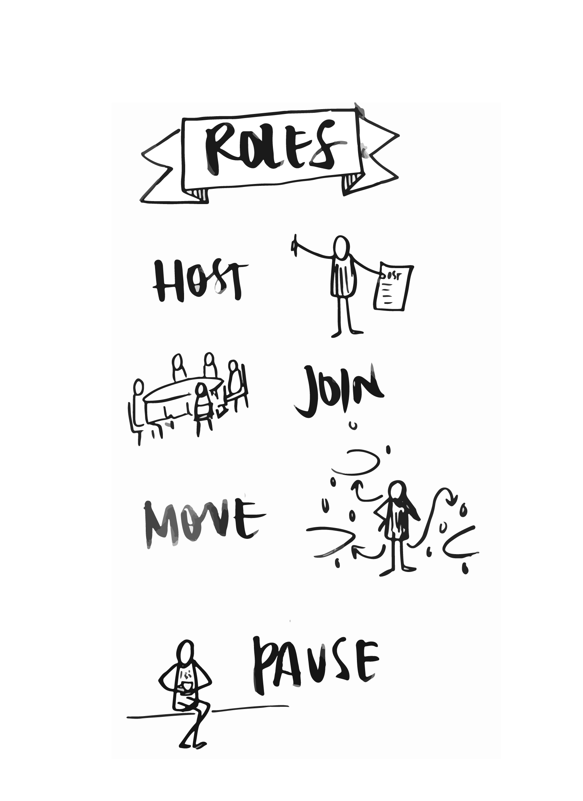

# Open Space Technology

**Purpose:** OST gives participants open time and space to discuss the points of importance, or run an idea by someone. It is a structured unstructured process which allows the agenda to be decided by the participants. It can be a really useful process when groups are having trouble focusing, don’t know what they want to be doing, or don’t feel engaged in the process/workshop. 

**Materials:** A Marketplace Template, templates for each conversation/activity, markers and post-it notes, as many available spaces as break-out conversations/activities that will happen, the calling question visible to the room \(either on top of the Marketplace or on a screen\) 

**Time:** Depending on the size of the group, OST can take anywhere from 2 to 4 hours.

**Step one:** Frame the reasons and history of Open Space Technology. Mention that in order to capitalise on some of the rich insights being generated, we are going to employ a method called Open Space Technology, developed by Harrison Owen. Harrison Owen developed Open Space Technology after, having organised conferences for many years, he found that the parts that people most enjoyed - that people felt were the most productive - were the coffee breaks. For the participants of his conferences, it was the open time and space to discuss the points of importance, or run an idea by someone. And so he developed a process and a way of organising conferences where the agenda was largely decided by the participants. 

**Step two:** Explain the roles for participating in OST. 

**HOST:** Participants can host a session, **JOIN:** Participants can join someone else’s session, **MOVE:** Participants can move between sessions, or **PAUSE:** Participants can pause \(take a break, reflect, get a coffee, have a one-on-one chat\). 

**Step three:** Read aloud the calling question for the OST. Make sure that post-it notes and markers are available to all participants. Invite participants to host a session related to the calling question - it might be a conversation or a creative or physical activity, it might be something they are an expert in or something they simply want to explore with others. Invite participants wanting to host to write their session title on a post-it note, bring it to the Marketplace, present the concept for their session to the group and choose a time slot and venue for the session. 

**Step four:** Once the market place is full, set the timing for each round \(your OST might have one, two or three rounds, depending on the number of people and time you have\). Typically, 45 minutes per round is enough, but rounds can last from 30 to 60 minutes. If having more than one round, encourage participants to revisit the Marketplace between rounds to check out the sessions for the second round and the see if any new sessions have popped up. 

**Step five:** Mention the _rules_ for OST. 

* Whenever it begins is the right time 
* Whenever it’s over, it’s over 
* Whoever comes are the right people 
* Whatever happens is the only thing that could have happened

It is helpful to have the rules written up on flipchart paper throughout the main space. 

**Step six:** Open the Open Space. It is a good idea to delay the beginning of the first round by 10 minutes or so to give hosts time to pick up their templates, markers and post-it notes and participants time to look at the Marketplace, get a cup of coffee, and get to their first session. 

**Step seven:** As the first session comes to an end, let people know with a bell - but remember that conversations may flow into the next session and try not to be too intrusive. After opening the OST, it largely runs itself, but it is often a time when participants will seek out facilitators for one-on-one conversations. Step eight: To close the OST, invite the session hosts to share highlights, "aha moments" and key learnings with the larger group. If you have time, you can close the session in circle, inviting everyone to share their insights from the process. You may choose to display the templates on the wall for others to be able to read and/or for the graphic recorder to get a sense of the different sessions to incorporate into the mural.

#### More resources: [http://openspaceworld.org/wp2/what-is/](http://openspaceworld.org/wp2/what-is/)

