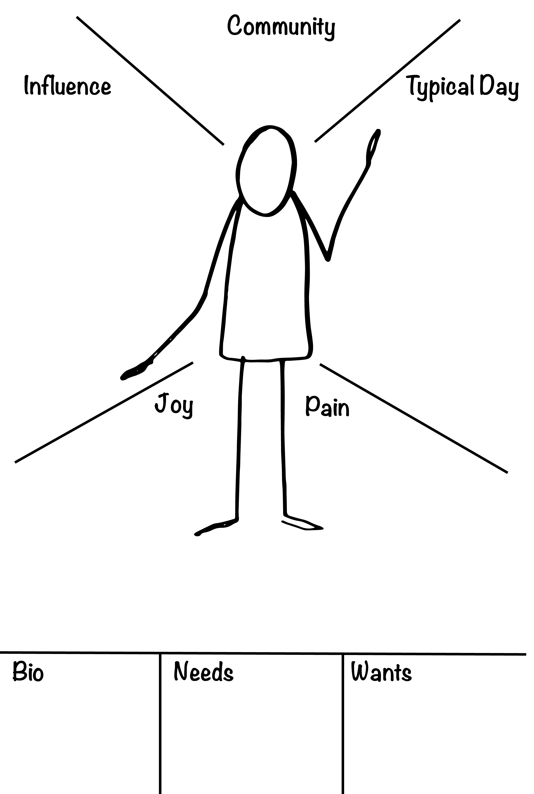

# Persona Development

**Purpose:** Participants create one robust relatable persona or archetype as a collective persona in order to be able to better empathise with the end user that they will be designing solutions for.

**Materials:** One or two pieces of blank paper per person, a piece of flipchart paper for each team to create their collaborative persona on, a piece of flipchart paper with a persona template on it, markers for the table. If participants have conducted user-interviews prior to this activity, remind them to bring the notes from the interviews.

**Time:** 90 minutes

**Step one:** If participants have engaged in user-interviews before this activity, explain to them that this will be an opportunity to work with this information to create a meaningful model of one end-user that they will be able to keep in mind when designing solutions. If participants have not conducted user-interviews beforehand, they can create a persona based on their experience.

**Step two:** Give participants 20 minutes to begin to create their personas individually on the blank paper. Ask them to draw and makes notes on the following: 

1. Who is this person? Draw person, and record their basic demographic information such as name, age, gender, sexuality, religion, socio-economic status, education, where they live, what they do. 
2. Who is part of their community? 
3. Who/what influences them? 
4. What does a day look like for this person? 
5. Who/what does their community consist of? 
6. Where does this person find joy? 
7. Where to they feel pain?
8. What are their needs?
9. What are their wants?

**Step three:** Have participants share the stories of their personas with the others on their team. This should take ~20 minutes.

**Step four:** Explain to participants that they will need to collaboratively create one user persona that will serve for the whole team. Have them discuss the patterns and themes that occured across their individual user templates, including some of the more detailed areas from each member of the team. Give participants 20-30 minutes.

**Step five:** Invite each group to share their persona with the rest of the room, before taping it to the wall, or in their large team template, where it can be seen by all team members, as it will serve as a reminder to put the end-user at the centre of the work for the remainder of the workshop. Often, we hear participants ask each other things like, “But what would \(name of persona\) think of this?” or “Would that serve \(name of persona\)’s needs?”

**Step six:** If time allows, have the group debrief the activity with one or two questions. These could be questions about the process \(this can be an emotional experience for some people, especially if they are front-line workers or the challenge is particularly difficult\), or questions that would begin to cultivate seeing the challenge from the user’s perspective.

For example: What is this experience bringing up for you? How do these feelings impact/drive your work? or, What is a small concrete change that could have a positive impact on this person?

#### More resources: [https://www.interaction-design.org/literature/article/personas-why-and-how-you-should-use-them](https://www.interaction-design.org/literature/article/personas-why-and-how-you-should-use-them)

