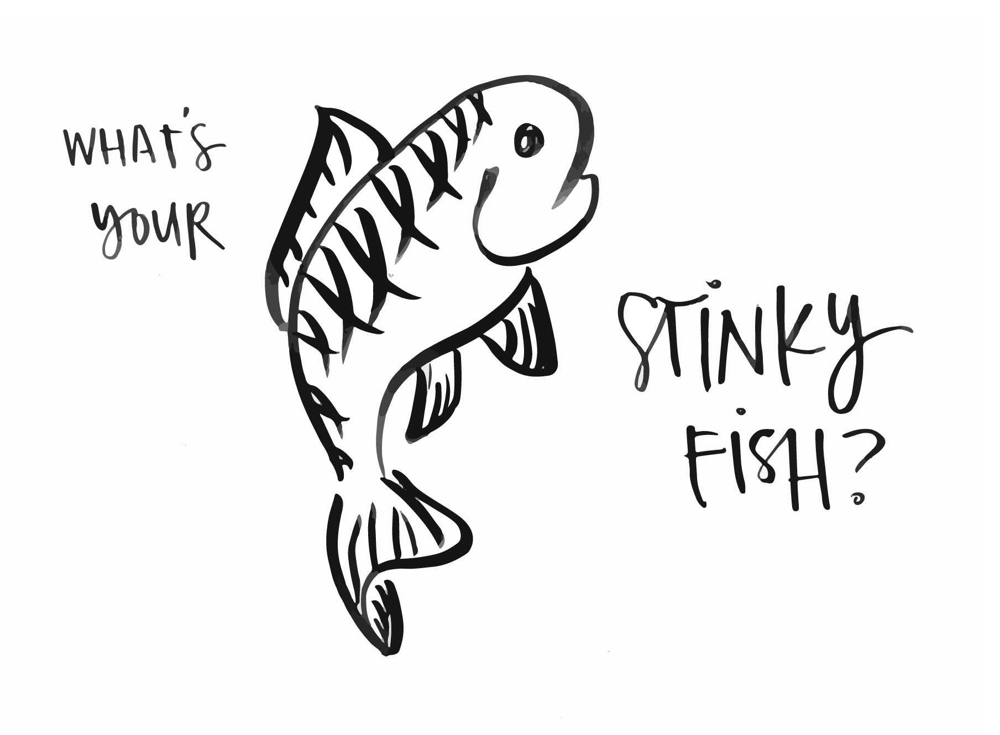

# Stinky Fish

**Purpose:** A short activity to run early in a program, focused on sharing fears, anxieties and uncertainties related to the program theme. The purpose is to create openness within a group. The stinky fish is a metaphor for "that thing that you carry around but don’t like to talk about; but the longer you hide it, the stinkier it gets." By putting stinky fish \(fears and anxieties\) on the table, participants begin relate to each other, become more comfortable sharing, and identify a clear area for development and learning.

**Materials:** A piece of blank paper and marker per participant

**Time:** 20-30 minutes

**Step one:** Introduce the purpose of the exercise in your own words. Explain that the purpose is to explore and share our individual worries/concerns about the future as a way to start a conversation and begin to confront or overcome them. Show participants a template of the stinky fish and explain the metaphor of the Stinky Fish: “The Stinky Fish that thing that you carry around but don’t like to talk about; but the longer you hide it, the stinkier it gets. It’s a metaphor for a fear or anxiety; something that will only get worse if you don’t acknowledge and deal with it.” 

**Step two:** Give participants around 5 minutes to draw their fish and write down their personal stinky fish for the context of the program. For example, if the context is an organisational change workshop, the stinky fish would be about fears and anxieties related to change in our organisation. They should write only a few words or a phrase inside the body of the fish.

**Step three:** Once all participants have written their stinky fish, invite teams to share their stinky fish with one another. Alternately, invite the group back, sit in a circle, and have each participant share their fish to the rest of the group. Ask participants to share one at a time, for 30 to 60 seconds each. Continue until all participants have shared. Optional: You could have teams debrief their stinky fish with a few questions, such as: “What if… everyone thought like me…?” “What if… everyone were willing to change…?” “What if… ?”

**Step four:** Wrap-up the exercise by thanking participants and reminding them that in the rapidly-changing world, uncertainty and worry about the future are totally normal. Explain that "putting fish on the table" is an important first step to confronting and dealing with worries and fears. If relevant, explain that elements of the program to follow will offer the chance to further explore some of these stinky fish. Optional: The fish can be displayed - as a kind of gallery - for people to be aware of throughout the programme and can be a nice touch point to come back to later on in the programme. If you do this, make sure you inform participants that their stinky fish will be on display.

**More Resources:**[ **https://toolbox.hyperisland.com/stinky-fish-13d9ce8d-e64f-4085-8a06-8d212c627788**](https://toolbox.hyperisland.com/stinky-fish-13d9ce8d-e64f-4085-8a06-8d212c627788)**​**

  

